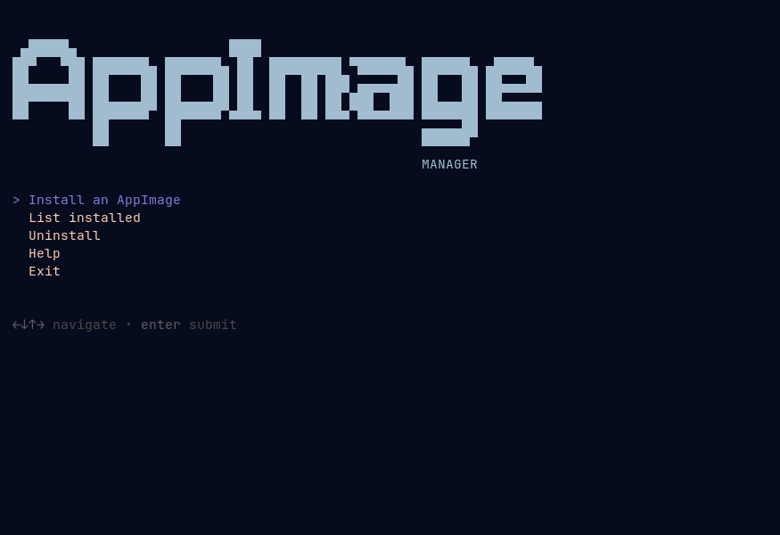

# AppImage Manager

[](https://github.com/brunomnsilva/appimage-manager/actions/workflows/ci.yml)
[](https://github.com/brunomnsilva/appimage-manager/releases)
[](LICENSE)

**Manage your AppImages** inside your user environment — no root required. 

> The tool tracks installed AppImages and lets you list, update, and remove them afterwards. See [how it works](#how-it-works). 



It ships with two frontends that share the same core logic:

- `appimage-manager-tui.sh` — an interactive TUI (powered by [gum](https://github.com/charmbracelet/gum)) for installing, listing, and uninstalling AppImages.
- `appimage-manager.sh` — a scriptable command-line interface.


---

## Features

- **No root** — writes only to your user directories.
- **App menu integration** — generates a freedesktop-compliant `.desktop` launcher.
- **Icon support** — uses a provided icon, or extracts one from the AppImage when possible.
- **Full lifecycle** — install, list, update, and uninstall AppImages.
- **Safe defaults** — validates inputs, handles spaces, and avoids destructive changes unless `--force` is used.
- **Smart launcher** — the generated wrapper detects a missing `libfuse2` and auto-falls-back to `--no-sandbox` if the first launch fails (helps on Ubuntu 24.04).
- **Self-contained distribution** — `make bundle` inlines the library so each entrypoint can be shipped as a single file.

## Requirements

- Linux desktop with a freedesktop-compatible menu, i.e., through [XDG Desktop Portal](https://wiki.archlinux.org/title/Desktop_entries).
- Bash 4+.
- `gum` (required for the TUI; not needed for the CLI). Both gum 2.x and older
  builds such as 0.16 (Fedora 43) work: picker padding is applied only when the
  running gum supports it.
- Optional: `file` for better icon type detection (usually preinstalled).
- Development only: `shellcheck` and `shfmt` (for `make test` / `make fmt`).

## Project structure

```
appimage-manager.sh          # CLI entrypoint
appimage-manager-tui.sh      # TUI entrypoint (gum)
lib/core.sh                  # shared library (no side effects)
scripts/build.sh             # bundles lib/core.sh into dist/ entrypoints
Makefile                     # bundle / test / lint / fmt / clean
tests/run-tests.sh           # headless test harness
```

## Quick start

### TUI

```bash
chmod +x appimage-manager-tui.sh
./appimage-manager-tui.sh
```

The TUI walks you through an install, or lets you list and uninstall existing
apps from the main menu.

### CLI

```bash
chmod +x appimage-manager.sh
./appimage-manager.sh ~/Downloads/Obsidian.AppImage
```

This copies the AppImage to `~/Applications/`, writes
`~/.local/share/applications/<slug>.desktop`, and installs an icon when one can
be extracted.

## TUI usage

The main menu offers:

- **Install an AppImage** — file picker, then prompts for name (prefilled from
  the filename), comment, category, launch args, and icon. A file that is not a
  valid AppImage (e.g. a standalone binary such as Winbox) triggers a warning
  and offers to install it anyway; auto icon extraction is skipped, so provide a
  custom icon.
- **List installed** — shows a table of installed apps (name, path, status).
- **Update an AppImage** — pick an installed app and a newer AppImage; the
  payload is replaced in place, keeping the name, menu entry, launch flags, and
  icon (or choose a new icon). A warning reminds you to back up the current
  file first.
- **Uninstall** — select an app and confirm removal.
- **Help** — brief description.
- **Exit** — quit.

### Category presets

The installer presents a single-select list of common freedesktop categories
(`Utility`, `Development`, `Office`, `Graphics`, `AudioVideo`, `Network`,
`Game`, `Education`, `Science`, `System`) plus **Custom…** for free-form input.

### Launch-args presets

Instead of typing flags, pick from common presets (multi-select) or choose
**Custom…**:

| Preset | Value |
|---|---|
| `--no-sandbox` | `--no-sandbox` |
| `--disable-gpu` | `--disable-gpu` |
| `--disable-dev-shm-usage` | `--disable-dev-shm-usage` |
| Wayland (auto) | `--ozone-platform-hint=auto` |
| Wayland (native) | `--enable-features=UseOzonePlatform,WaylandWindowDecorations --ozone-platform-hint=auto` |

## CLI options

| Option | Description |
|---|---|
| `--name NAME` | Display name and base filename (default: from the AppImage filename) |
| `--categories CATS` | Desktop menu categories (default: `Utility;`) |
| `--comment TEXT` | One-line description for the launcher |
| `--icon PATH` | Custom icon file (`.png` or `.svg`) |
| `--exec-args ARGS` | Extra args appended to the launch (e.g. `--no-sandbox`) |
| `--force` | Overwrite existing AppImage, desktop entry, and icon |
| `--skip-validation` | Install/update a file even if it is not a valid AppImage (e.g. a standalone binary); icon auto-extraction is skipped |
| `--list, -l` | List installed AppImages and exit |
| `--update TARGET` | Replace an installed app's AppImage (TARGET is its slug or display name); the positional path is the new file |
| `-h, --help` | Show usage |

### Examples

```bash
# Basic install
./appimage-manager.sh ~/Downloads/Obsidian-1.5.3.AppImage

# Custom name and icon
./appimage-manager.sh --name "Obsidian" --icon ~/Pictures/obsidian.svg ~/Downloads/Obsidian.AppImage

# Chromium-based app that needs --no-sandbox
./appimage-manager.sh --name "Brave" --exec-args "--no-sandbox" ~/Downloads/Brave.AppImage

# Overwrite an existing install
./appimage-manager.sh --force ~/Downloads/Foo.AppImage

# List installed AppImages
./appimage-manager.sh --list

# Update an installed app with a newer AppImage (keeps its menu entry and icon)
./appimage-manager.sh --update Obsidian ~/Downloads/Obsidian-1.6.0.AppImage

# Update and replace its icon
./appimage-manager.sh --update Obsidian --icon ~/Pictures/obsidian.svg ~/Downloads/Obsidian-1.6.0.AppImage

# Install a standalone binary (not a real AppImage), e.g. Winbox
./appimage-manager.sh --skip-validation --name "Winbox" --icon ~/Pictures/winbox.png ~/Downloads/winbox
```

## How it works

1. Copies the AppImage to `~/Applications/` and ensures it is executable.
2. Tries to extract an icon by running the AppImage with `--appimage-extract`
   and searching common icon paths; if none is found, the AppImage path is used
   as a fallback icon.
3. Writes a small launcher wrapper to `~/.local/bin/` that:
   - sets `APPIMAGE_EXTRACT_AND_RUN=1` when `libfuse.so.2` is missing, and
   - retries with `--no-sandbox` if the normal launch fails.
4. Writes a `.desktop` entry that references the wrapper, sets `Path=` to
   `~/Applications`, and passes `%U` so file/URL arguments work from the menu.
5. Records the install in a registry so the TUI can list and uninstall it.

### Registry

Installed apps are tracked in:

```
${XDG_DATA_HOME:-$HOME/.local/share}/appimage-manager/registry.tsv
```

Each row stores the slug, name, AppImage path, desktop path, icon path, and
wrapper path. Apps installed before the registry existed are still detected by
scanning `~/Applications/*.AppImage` and shown as "**legacy**".

## Building a distributable

`make bundle` inlines `lib/core.sh` into each entrypoint, producing
self-contained single files (no `.sh` extension, so they read as commands):

```
dist/appimage-manager
dist/appimage-manager-tui
```

Install them into `~/.local/bin` (override the destination with `PREFIX`):

```bash
make install            # -> ~/.local/bin
make install PREFIX=/usr/local
make uninstall          # remove them from $(PREFIX)/bin
```

This is automated in CI (`.github/workflows/`): every push and pull request
runs the tests and uploads `dist/` as a workflow artifact, and pushing a `v*`
tag runs the same gates, writes `dist/SHA256SUMS`, and publishes both bundled
scripts as release assets:

```bash
git tag v1.0.0
git push origin v1.0.0
```

A release can be re-run without moving the tag, either from the Actions UI
(**Release → Run workflow**) or with:

```bash
gh workflow run release.yml -f tag=v1.0.0
```

Re-running rebuilds the assets and updates the existing release in place.

You can find the latest built files in *Releases*.

## Testing

```bash
make test   # shellcheck + shfmt check + build + functional tests
make lint   # shellcheck only
make fmt    # shfmt (rewrite)
make clean  # remove dist/
```

The test suite is headless and runs against an isolated `$HOME`, using stub
AppImages so nothing touches your real environment.

## Uninstall (manual)

Remove the installed files:

```bash
rm ~/Applications/<Name>.AppImage
rm ~/.local/share/applications/<slug>.desktop
rm ~/.local/bin/<slug>-appimage-launcher
rm ~/.local/share/icons/hicolor/256x256/apps/<slug>.png   # or .svg, if present
```

The TUI's **Uninstall** option does this automatically. Optionally refresh the
menu with `update-desktop-database ~/.local/share/applications` if available.

## Troubleshooting

- **App does not appear in the menu** — confirm the `.desktop` exists in
  `~/.local/share/applications/`, then log out/in (or reload the shell). Verify
  `Categories` includes a recognized category (e.g. `Utility;`).
- **Icon missing** — provide one with `--icon path/to/icon.svg|png`; some
  AppImages do not ship icons in standard locations.
- **Exec errors on launch** — some sandboxed apps need extra flags; use
  `--exec-args "--no-sandbox"` or the TUI presets. Confirm the AppImage has
  execute permissions.

### Sandboxing

On Ubuntu 24.04 and newer, some Electron/Chromium-based AppImages (Obsidian,
Brave, etc.) fail to launch from the menu even though they run from the file
manager. This is because Chromium's SUID sandbox helper is unavailable. The
generated launcher tries a normal launch first and then automatically retries
with `--no-sandbox`.

> **Warning:** `--no-sandbox` disables Chromium's sandbox process isolation and
> reduces security. Whether that is acceptable is up to you.

Recommended: install `libfuse2t64` (`sudo apt install libfuse2t64`) if
AppImages fail to run at all, and rely on the launcher's automatic fallback.

## Security notes

- Do not run untrusted AppImages.
- Writes only to user directories; no root required.
- All paths and variable expansions are quoted; the scripts use
  `set -Eeuo pipefail` and defensive checks.

## License

See `LICENSE`.

This application was heavily inspired in [AppImage-Install](https://github.com/lt-rawlins/AppImage-Install) and released under the same license.